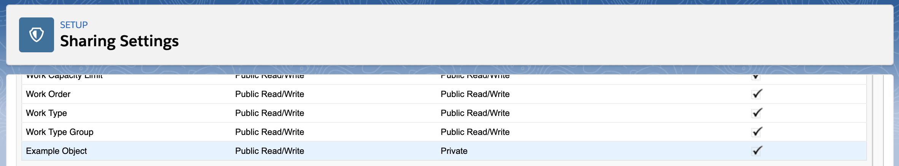

# [sfdx-custom-object-issue](https://github.com/dfruddffdc/sfdx-custom-object-issue)

## Replication steps

1. Authenticate with a DevHub
1. Run `sfdx force:org:create -f config/project-scratch-def.json -a custom-object-issue`
1. Run `sfdx force:source:push -u custom-object-issue`
1. Run `sfdx force:org:open -u custom-object-issue -p lightning/setup/SecuritySharing/home`

Notice that even though [Example_Object__c](./force-app/main/default/objects/Example_Object__c/Example_Object__c.object-meta.xml) specifies `externalSharingModel` of `ReadWrite`, the object is actually deployed with the sharing set to Private.

